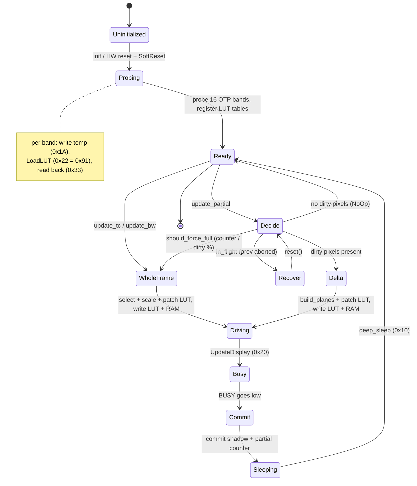

# SSD1675 / SSD1675B ePaper Display Driver

Async Embassy driver for the [Solomon Systech SSD1675 and SSD1675B][SSD1675]
e-Paper display (EPD) controllers, ported to `embedded-hal` 1.0 and
`embassy-time` for use on bare-metal embedded targets.

Originally forked from the [ssd1675 crate][original] by [Wesley Moore][wezm],
then extended for the [BornHack] Cyber Ægg badge by the
[Cyber Ægg badge team][badgeteam].

## Features

- **Auto-detects SSD1675 vs SSD1675B** from the OTP LUT read back at startup
  (7-byte vs 10-byte waveform row format)
- **Update modes (all take a `lut_speed` cycle-scale; `100` = OEM duration):**
  - `update_tc(lut_speed)` — full tricolor refresh (black, white, red) using the
    OTP waveform for the current temperature band
  - `update_tc_quick(lut_speed)` — faster tricolor refresh with the multi-repeat
    blink phases stripped
  - `update_bw(UpdateMode, lut_speed)` — flicker-free black-and-white refresh
    using the inversion-stripped (no-invert) LUT; choose Mode 1 or Mode 2
- **Delta update** — `update_partial(&mut PartialState, lut_speed)` drives only
  the pixels that changed since the last refresh; unchanged pixels route to the
  LUT IGNORE class and hold. The host-side `PartialState` tracks the dirty
  bitmap and builds the RAM planes. (These panels do not support a
  controller-windowed area refresh; the delta path is the only partial mode.)
- **Per-temperature LUT tables** via `register_lut_tables(full, no_invert)`:
  16 boot-probed 107-byte waveforms (one per 4 °C band), indexed by
  `set_active_temperature()`. No fallback — a refresh before registration
  panics.
- **`DisplayVariant` getter / setter** — `variant()` queries the detected
  variant; `set_variant()` overrides it when known out-of-band (e.g. from
  `detect_variant_from_otp()`)
- **Border suppression** — `BorderWaveform(0x80)` is applied automatically
  before every update to prevent the border pixel from flashing
- **`embedded-graphics` integration** via the `GraphicDisplay` wrapper and the
  `graphics` feature (enabled by default)

## Usage

### Setup

```rust
use ssd1675::{Builder, Dimensions, Display, GraphicDisplay, Interface,
              Rotation, UpdateMode};
use ssd1675::display::DisplayVariant;

// Build the hardware interface from an SpiDevice, busy pin, DC pin, reset pin.
let controller = Interface::new(spi_device, busy_pin, dc_pin, reset_pin);

let config = Builder::new()
    .dimensions(Dimensions { rows: 152, cols: 152 })
    .rotation(Rotation::Rotate0)
    .build()
    .unwrap();

let mut display = Display::new(controller, config);

// Register the per-temperature LUT tables. Both are 16 × 107-byte arrays in
// 'static storage (e.g. via StaticCell): `full` is the raw OTP waveform,
// `no_invert` is the same with inversion phases zeroed (see `patch_no_invert`).
// They come from boot-probing the controller's OTP at 16 temperatures — see
// `init_epd` in `src/fw/epd.rs` of the firmware for the full probe sequence.
display.set_variant(variant); // e.g. from detect_variant_from_otp(&probed)
display.register_lut_tables(full_table, no_invert_table);

// Ambient temperature (°C × 10) picks the LUT band on each refresh.
display.set_active_temperature(225); // 22.5 °C

let mut gfx = GraphicDisplay::new(display, black_buf, red_buf, work_buf);
```

### Full tricolor update (black + red)

```rust
use embedded_graphics::prelude::*;
use embedded_graphics::primitives::{Circle, PrimitiveStyle};
use ssd1675::graphics::Color;

gfx.reset().await?;
gfx.clear(Color::White);

Circle::new(Point::new(10, 10), 50)
    .into_styled(PrimitiveStyle::with_fill(Color::Black))
    .draw(&mut gfx)?;

gfx.update_tc().await?;
gfx.deep_sleep().await?;
```

### Black-and-white update using the OTP waveform

`UpdateMode::Mode1` uses the LUT register directly (no OTP reload).
`UpdateMode::Mode2` reloads the full OTP waveform from the controller.

```rust
gfx.reset().await?;
gfx.clear(Color::White);
// draw ...
gfx.update_bw(UpdateMode::Mode1).await?;
gfx.deep_sleep().await?;
```

### Partial update

```rust
gfx.reset().await?;
// draw into gfx ...
gfx.partial_update(start_x, start_y, width, height).await?;
```

### Querying the detected controller variant

```rust
use ssd1675::display::DisplayVariant;

match gfx.variant() {
    DisplayVariant::Ssd1675B => { /* 10-byte row LUT */ }
    DisplayVariant::Ssd1675  => { /* 7-byte row LUT  */ }
}
```

## Refresh lifecycle

The controller is probed once at startup, then each refresh runs a short drive
sequence and returns the panel to deep sleep. Whole-frame refreshes
(`update_tc` / `update_bw`) drive every pixel; `update_partial` first decides
between a no-op, a promoted full refresh, or a delta drive based on the
host-side dirty bitmap.



## Hardware

Tested on the [BornHack] Cyber Ægg badge (nRF52840, `thumbv7em-none-eabihf`)
with 152×152 SSD1675 and SSD1675B panels. See `src/fw/epd.rs` in the
[Cyber Ægg firmware][firmware] for a complete integration example including OTP
LUT readback and temperature measurement.

## Changes from upstream

- Ported from blocking `embedded-hal` 0.2 to async `embedded-hal` 1.0 /
  `embedded-hal-async`; all display operations are `async fn`
- Added SSD1675B support with auto-detection from OTP LUT format
- Added `update_bw(UpdateMode)` using the factory OTP LUT waveform; falls back
  to a built-in fast LUT if no OTP LUT has been provided
- Added `UpdateMode` parameter to choose between Mode 1 and Mode 2 update
  sequences
- Added `set_otp_lut()` for factory waveform readback and variant detection
- Added `variant()` getter on `Display`
- Added `partial_update()` for region updates
- Applied `BorderWaveform(0x80)` before every update to suppress border flash
- Uses `embassy-time` for reset timing
- Rewrote `Interface` to use `SpiDevice<u8>` directly (removes
  `embassy-embedded-hal` dependency)
- Removed Linux/Raspberry Pi example (not applicable to bare-metal targets)

## Credits

- Original crate: [ssd1675][original] by [Wesley Moore][wezm]
- Extended for the [BornHack] Cyber Ægg badge by the
  [Cyber Ægg badge team][badgeteam]
- [Nicolai Electronics SSD1619 driver][ssd1619] — reference for OTP LUT
  structure and fast update waveform analysis
- [Waveshare EPD driver](https://github.com/caemor/epd-waveshare)
- [SSD1306 OLED display driver](https://github.com/jamwaffles/ssd1306)
- [Pimoroni Python library for Inky displays](https://github.com/pimoroni/inky)

## License

`ssd1675` is dual licenced under:

- Apache License, Version 2.0 ([LICENSE-APACHE](LICENSE-APACHE) or
  [Apache-2.0](http://www.apache.org/licenses/LICENSE-2.0))
- MIT license ([LICENSE-MIT](LICENSE-MIT) or
  [MIT](http://opensource.org/licenses/MIT))

[BornHack]: https://bornhack.dk
[badgeteam]: https://github.com/badgeteam
[firmware]: https://codeberg.org/Ranzbak/ssd1675
[original]: https://github.com/wezm/ssd1675
[SSD1675]: http://www.solomon-systech.com/en/product/advanced-display/bistable-display-driver-ic/SSD1675/
[ssd1619]: https://github.com/Nicolai-Electronics/esp32-component-ssd1619
[wezm]: https://github.com/wezm
